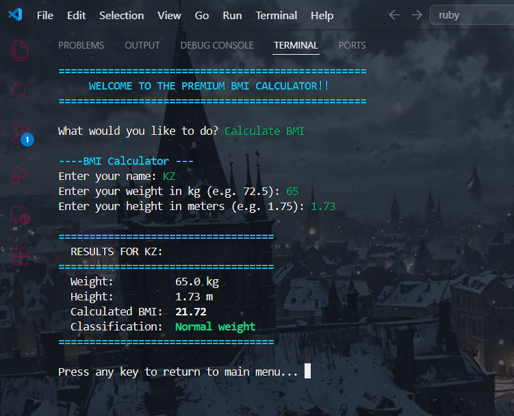
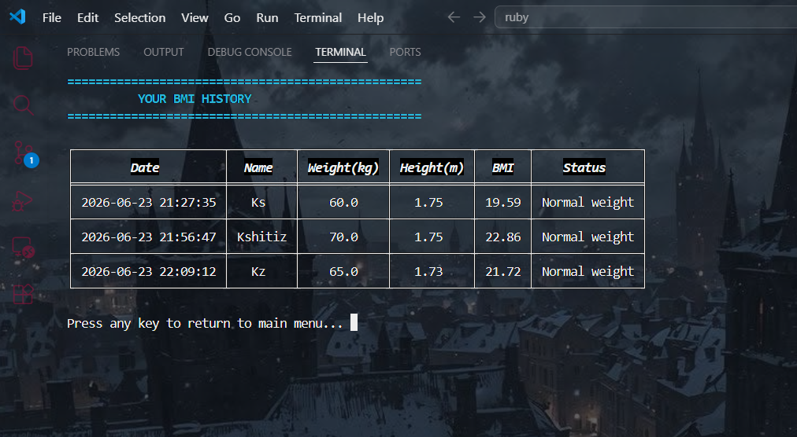

# Premium CLI BMI Calculator 🏋️‍♂️💻

A beautiful, interactive, and colorful Command Line Interface (CLI) application built in Ruby to calculate your Body Mass Index (BMI) and track your history over time.

## 📸 Screenshots

Here is a look at the CLI in action:

**Calculating BMI**


**Viewing BMI History**



## ✨ Features

- **Interactive Menus:** Navigate through the app effortlessly using your keyboard's arrow keys (powered by `tty-prompt`).
- **Colorful Output:** Beautifully styled terminal output with dynamic colors based on your health classification (powered by `pastel`).
- **Tabular Data:** Easy-to-read reference tables and history logs with perfectly aligned unicode borders (powered by `terminal-table`).
- **History Tracking & Persistence:** Automatically saves your past calculations to a JSON file so you can monitor your progress over time.
- **Visual Gauge (Coming Soon):** A visual ASCII-art gauge pointing to exactly where your BMI falls on the scale!

## 🚀 Getting Started

### Prerequisites

Make sure you have Ruby installed on your computer.

### Installation

1. Clone this repository to your local machine:
   ```bash
   git clone https://github.com/yourusername/ruby-bmi-calculator.git
   cd ruby-bmi-calculator
   ```

2. Install the required gems using Bundler:
   ```bash
   bundle install
   ```
   *(This will install `tty-prompt`, `pastel`, and `terminal-table` as defined in the `Gemfile`)*

### Usage

Run the application from your terminal:
```bash
ruby BMI_calculator.rb
```

Follow the on-screen prompts to enter your name, weight, and height, and let the app do the rest!

## 🛠️ Built With
- [Ruby](https://www.ruby-lang.org/)
- [TTY-Prompt](https://github.com/piotrmurach/tty-prompt)
- [Pastel](https://github.com/piotrmurach/pastel)
- [Terminal-Table](https://github.com/tj/terminal-table)

## 📄 License
This project is open-source and available for anyone to use and modify!
